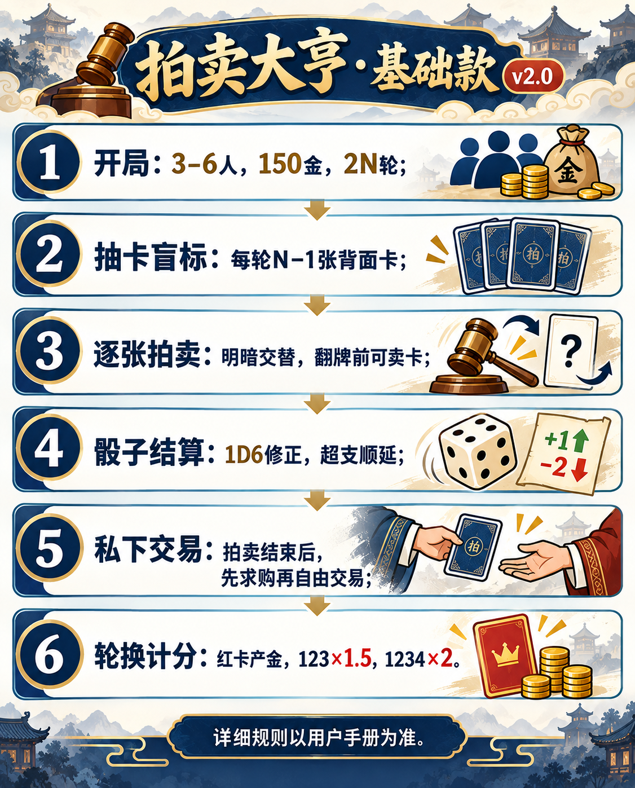

# 拍卖大亨·基础款 v2.1｜用户手册（规则 v2.0）

在线版：[打开游戏](https://rick1269.github.io/millennium-treasures-online/) · [图文手册](https://rick1269.github.io/millennium-treasures-online/manual.html)

## 开始游戏

1. 选择邮箱账号或游客身份，创建房间并分享链接。新进房的朋友先旁观，点击空座位即可入席；房主可点击座位安排或移走机器人，并在至少 3 位藏家入席后决定开局。每人 150 金。
2. 随机选取与人数相同的时代，秘密藏起其中一张红卡。每时代 1/2/3/4 星数量依次为 3/3/2/1，估值依次为 10/20/30/40。
3. 每人掷 1D6，最高者成为首位起始玩家，并决定全场固定轮换方向。总共进行 `2 × 人数` 轮。

## 九时代卡牌名录

| 时代 | 1 星（×3） | 2 星（×3） | 3 星（×2） | 4 星红卡 |
|---|---|---|---|---|
| 春秋战国 | 布币 | 莲鹤方壶 | 曾侯乙编钟 | 越王勾践剑 |
| 秦 | 半两钱 | 秦陵铜车马 | 秦俑将军俑 | 传国玉玺 |
| 汉 | 五铢钱 | 长信宫灯 | 马王堆帛画 | 金缕玉衣 |
| 三国 | 太平道符 | 铜雀台瓦砚 | 青釭剑 | 的卢马 |
| 唐 | 开元通宝 | 唐三彩骆驼 | 簪花仕女图 | 兰亭序真迹 |
| 宋 | 交子 | 汝窑天青釉洗 | 清明上河图 | 苏轼寒食帖 |
| 元 | 中统元宝交钞 | 青花鬼谷子下山罐 | 元青花萧何追韩信梅瓶 | 富春山居图 |
| 明 | 大明宝钞 | 成化斗彩鸡缸杯 | 永乐大典 | 万历金翼善冠 |
| 中国民国 | 袁大头 | 中山装 | 张大千泼墨山水 | 翠玉白菜 |

## 每轮依次操作

1. 轮换结算：红卡产金，拍卖行按星级分别掷骰更新议价加成。
2. 背面抽出 `人数−1` 张卡；起始玩家盲标一张心仪卡，选中卡移到首位先拍，并决定第一张用明拍还是暗拍。之后明暗交替。
3. 逐张拍卖：**每张翻面前**，桌面出售区显示四种星级倍率；所有玩家可向拍卖行卖任意张手牌，每次出售前弹窗确认实收。玩家可在已准备和未准备之间切换；全员准备后，起始玩家才可关闭窗口并翻牌竞拍。起始玩家也能出价。
4. 全部公开拍卖结束后才私下交易：先求购；求购未成功，起始玩家可拿自己一张卡提出一次自由交易，对方可拒绝。
5. 起始玩家按方向轮换，未到期的禁拍立即解除。

## 竞拍与付款

明拍起价为估值一半，至少 5 金，每次加价至少 2 金；可用 +2/+5/+10 按钮填写金额，再点击出价。暗拍无起价，秘密填整数报价；在线版填 0 表示放弃。最高价并列者最多重拍三次，仍并列则流拍。

落槌后只投一次 1D6。1/2/3 点的修正为 `+星级 × 点数`；4/5/6 点的修正为 `−星级 × (点数−3)`。实际付款为 `max(0, 报价+修正)`。起始玩家若拍到心仪卡，实付八折；不足 1 金的小数向上取整。没有额外竞拍佣金。

已有一张红卡，拍卖取得第二张时加 50% 奢侈税；第三张起加 100%。落槌者若付不起，禁拍接下来两场；第二、第三高价者按各自报价和**同一颗骰子修正**依次接手。接手者超支不受禁拍。全部超支则流拍。禁拍到下一次起始玩家轮换时提前解除。此时出售窗口已关闭，不能卖手牌凑款。

## 拍卖行与红卡

拍卖行对每个星级分别投 1D6：1–2 点加 10%，3–4 点加 20%，5–6 点加 30%。加成累积至最多 +30%。每出售一张，该星级加成下降 10 个百分点，没有加成下限；实际收购价最低为 0 金。收购价按卡牌估值乘当前倍率取整。拍卖行只收购，不出售普通卡，也不收佣金。卖出红卡须从成交价中扣 20% 税。

每次起始玩家轮换时，每张红卡为持有人产金：未集齐同系 1、2、3 星，按同系手牌数 ×2；集齐后按 ×4。红卡可卖出或私下交易；私下交易不掷价格骰，红卡卖方按成交金币的 20% 缴税。

## 终局计分

同一时代集齐 1、2、3 星，各张估值 ×1.5；再有红卡，各张估值 ×2。被藏红卡时代最多 ×1.5。重复卡照常得分，但不能替代缺失星级。

**总分 = 剩余金币 + 藏品加成后估值 − 被没收的红卡估值。** 持有红卡却缺同系 1/2/3 任意一种时，仅没收该红卡估值；其余藏品照常计分。总分相同先比金币，再比完整四星套数，仍同则按入席顺序。

## 联机提醒

六个头像座位围绕拍卖桌，观众位于旁观席。开局后座位锁定，晚到的朋友仍可旁观。入房者可发文字消息，也可按住语音键录制、松开发送，单条最多 15 秒；语音录制需允许浏览器使用麦克风。观众可交流但不能竞价或查看他人手牌。自己的非红手牌只对本人可见；红卡获得后全场可见。账号玩家离线后可重新接管；游客关闭浏览器后可能失去原席位。旧版房间不会自动转为 v2.0 规则，请重新创建房间。

## 操作辅助

- 手机端“桌面”就是当前拍卖与操作页；底部可进入“藏品”，或打开“交流”抽屉。房间码、记录和超时设置在页头菜单，问号可查看玩法。
- 出价时显示六种骰面下的可能实付区间；最高实付超过余额时提醒失约风险。落槌后，桌面显示本张成交或流拍的结算明细。
- 心仪卡在背面选择后移至首位，拍卖时保持金色边框；拍前出售可撤回准备，卖卡前先核对弹窗金额。
- 求购与自由交易在提交或同意前预览卡牌、金币、红卡税和预计余额。
- 藏品页按时代显示估值与缺少的星级；终局排名可展开逐时代计分。
- 轮到真人操作时开始 90 秒倒计时。玩家可在房间信息中选择超时后按机器人策略托管，或竞拍时自动放弃；托管后可在桌面接管席位。
