# 拍卖大亨 · 三人局 UI 与产品设计确认稿

版本：当前实现快照，2026-09-25。适用范围：本工程 `web/game.js`、`web/app.js`、`web/style.css`、本地服务与 Supabase 云端实现。截图由确定性三人演示局渲染当前网页得到；演示数据仅用于展示界面，不代表固定牌序或建议策略。

**阅读方式。** 先看第 1 节的三人局基准和第 2 节流程，再按第 3-10 节逐项勾选“符合 / 待调整”。“当前实现”描述本地代码实际行为；第 11 节逐项核对附件《拍卖玩法优化建议.pdf》的 2.2.2 六项。设计稿若与旧版说明书冲突，以本稿列明的当前代码行为为准，产品可在确认栏提出改动。

## 0. 产品快速确认页

| 核心决策 | 当前实现 | 产品确认 |
|---|---|---|
| 三人局长度 | 3 人、3 个时代、26 张入局牌、每人 150 金、6 轮、每轮 2 张正式拍卖卡 | □符合 □待调整 |
| 起始玩家 | 开局掷骰，最高者任首位；并列最高重投；首位选择顺/逆时针，之后固定 | □符合 □待调整 |
| 心仪卡 | 起始玩家在 2 张背面卡中标 1 张；本人拍得该卡实付八折；选中卡移至首位先拍，牌背与拍卖卡常亮边框 | □符合 □待调整 |
| 拍卖方式 | 第一张由起始玩家选明/暗拍；第二张自动交替；起始玩家可竞拍 | □符合 □待调整 |
| 拍前出售 | 每张翻面前全员可向银行卖任意手牌；出售前弹窗显示实收金额；已准备可撤回为未准备；全员准备才翻牌 | □符合 □待调整 |
| 成交价 | 最高有效报价 + 一次 D6 星级修正，最低 0；心仪卡折扣与额外红卡税依次计算 | □符合 □待调整 |
| 私下交易 | 两张正式拍卖后先求购；求购不成交才允许一次自由交易 | □符合 □待调整 |
| 红卡 | 持有后公开；每轮开局给持有人产金；拍卖再得红卡可能缴奢侈税；转售收 20% 税 | □符合 □待调整 |
| 终局 | 金币 + 藏品时代倍率估值 - 未成套红卡没收额；同分先比金币、完整四星套数、入席顺序 | □符合 □待调整 |
| 超时与离线 | 当前行动 90 秒未完成可自动托管；云端 60 秒无在线心跳视为离线托管；账号可回来接管 | □符合 □待调整 |

## 1. 三人局基准与信息边界

**卡牌与人数。** 九时代卡库共 81 张，每个时代 1 星 3 张、2 星 3 张、3 星 2 张、4 星红卡 1 张。三人局随机抽 3 个时代，共 27 张，再随机隐藏其中 1 张红卡，实际入局牌堆 26 张。隐藏红卡直到终局揭示，不进入拍卖。每名玩家初始 150 金，金币不能为负；终局分可以低于 0。

**时间轴。** 三人局恰好 6 个主持轮，每轮抽 2 张背面牌，最多 12 场正式拍卖。每轮 1 位起始玩家，按开局定好的方向轮换。主持身份不限制参与正式拍卖。初始牌堆足够覆盖三人局的 12 次抽牌；通用规则仍保留“牌堆空时将流拍区洗回”的兜底。

**可见与隐藏。** 全员可见座位、昵称、金币、藏品张数、已获得的红卡、拍卖行倍率、公开竞价、拍卖记录。普通手牌仅本人可见；背面候选卡与暗拍报价在揭晓前不可见；隐藏红卡仅终局公开。旁观者能看公开局面并聊天，不能查看私牌或竞拍。

| 参数 | 三人局值 | 产品确认 |
|---|---|---|
| 入局时代 / 牌数 | 3 个时代；隐藏红卡后 26 张 | □符合 □待调整 |
| 主持轮数 / 正式拍卖 | 6 轮；每轮 2 张；最多 12 场 | □符合 □待调整 |
| 起始金币 / 下注粒度 | 150 金；所有报价为非负整数 | □符合 □待调整 |
| 每轮行动顺序 | 红卡产金 → 4 星级银行倍率更新 → 背面选心仪卡与模式 → 逐张出售和拍卖 → 求购 → 可选自由交易 → 轮换 | □符合 □待调整 |

## 2. 三人局从建房到终局的逐步走查

### 2.1 建房、入席、开局

1. 甲以账号或游客身份创建房间，自动坐 1 号位；乙、丙打开房间后先在旁观席，可点空位入席。房主也可在空位安排机器人。满 3 位藏家后，房主可开局；最多 6 个席位。
2. 开局随机抽取 3 个时代与隐藏红卡。甲乙丙分别掷 D6，最高者成为首位起始玩家；并列最高者重掷。例：甲 5、乙 5、丙 2，则甲乙重掷。
3. 起始玩家在本轮“盲标与定序”页，从 2 张背面卡选 1 张心仪卡，选中卡移至首位先拍；选择第一张明拍或暗拍，并在第一轮选定顺/逆时针方向。其他玩家看到背面卡与等待提示，看不到牌面。

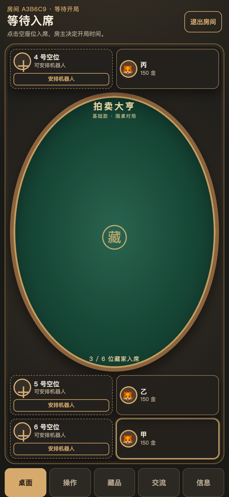

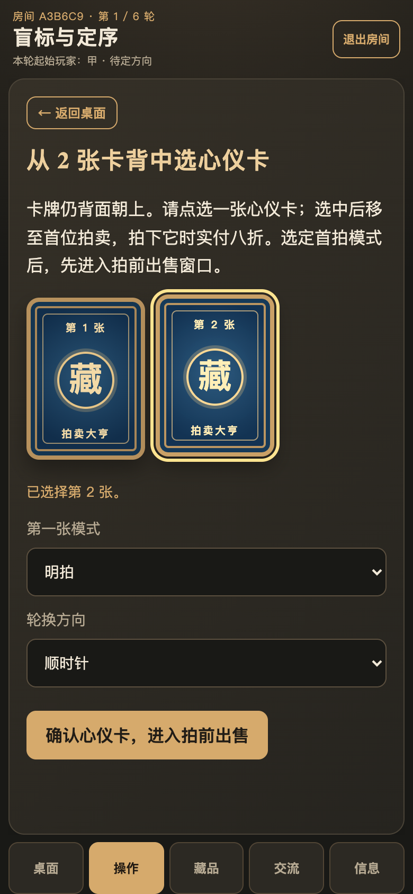

### 2.2 两张正式拍卖卡逐张处理

4. 起始玩家确认心仪卡后，进入第 1 张的“拍前出售窗口”。四种银行倍率固定显示在操作页上方。每个人可按当前倍率卖出任意数量自己的藏品；点击出售先弹窗确认成交价、红卡税与实收。卖出红卡另扣 20% 税，每售出 1 张对应星级倍率减 10 个百分点。
5. 每人可在“未准备 / 已准备”之间切换；已准备时停止出售，撤回后可继续卖。全员准备后，由起始玩家翻牌进入明拍或暗拍。第 2 张重复相同出售窗口和拍卖过程；拍法与第 1 张相反。
6. 明拍轮到某人时，可按起拍价或当前最高价 + 至少 2 金继续出价，或使用 +2 / +5 / +10 将输入额设为对应加价，确认后提交，也可退出本场。暗拍每人提交一次 0 至自己金币的整数报价，0 为放弃；最高同价者进入重拍。
7. 落槌后对本张卡只掷一次 D6，按星级修正最高有效报价。起始玩家如拍中自己标记的那一张，再享八折。若本次通过拍卖得到第二/第三张红卡，再加奢侈税。页面显示可能实付区间与最终结算单。

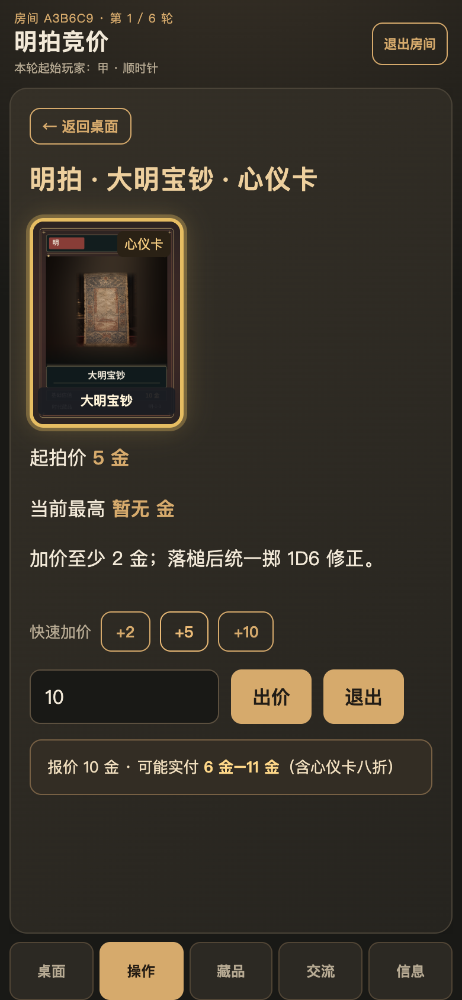

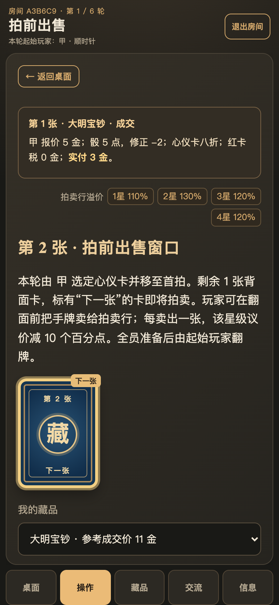

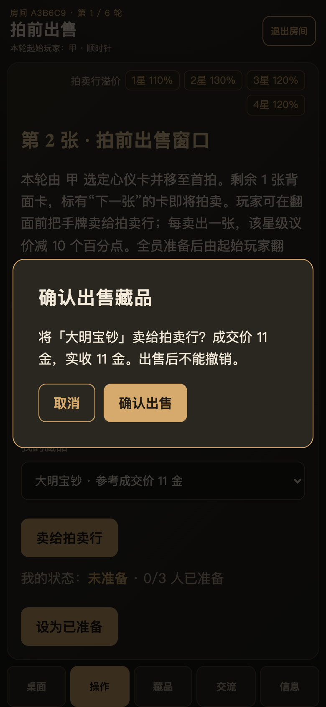

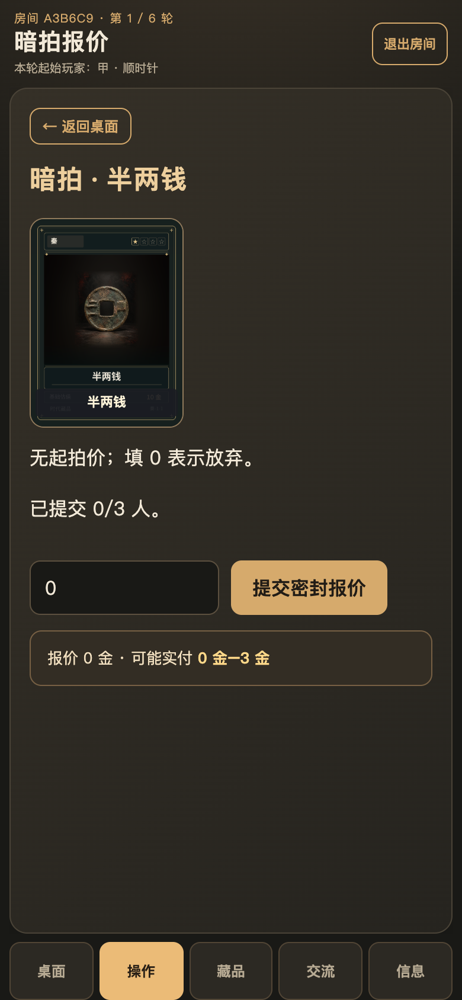

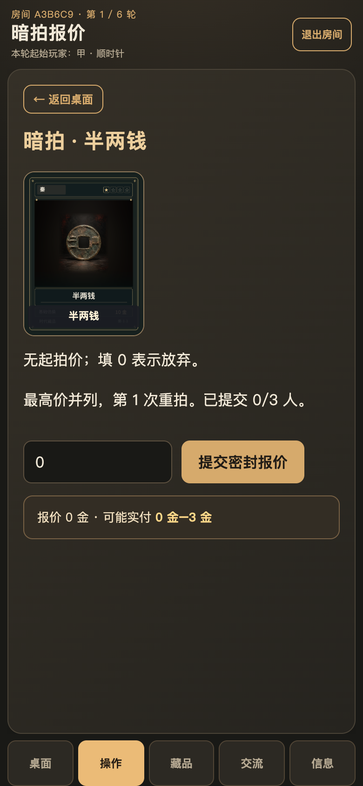

### 2.3 两张拍完后交易、轮换和结算

8. 起始玩家可输入“卡牌准确名称 + 求购金币”，其他两人分别选择响应或不出售。若多人愿卖，起始玩家选其中一位；也可放弃本次求购。
9. 求购未成交时，起始玩家才可拿自己的 1 张卡提出一次自由交易，可指定对方卡名和双方金币。对方同意才交换，否则本轮交易结束；没有第二次出价机会。
10. 本轮结束，起始玩家点击轮换；下一轮先对当前持有红卡者产金，再更新四种星级银行倍率。完成第 6 轮后展示隐藏红卡、总排名和逐时代计分。

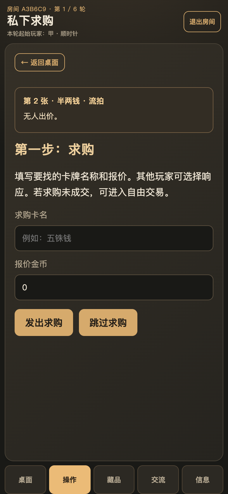

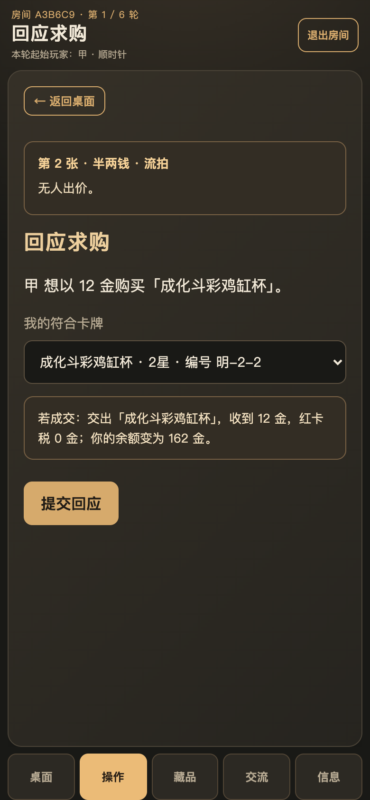

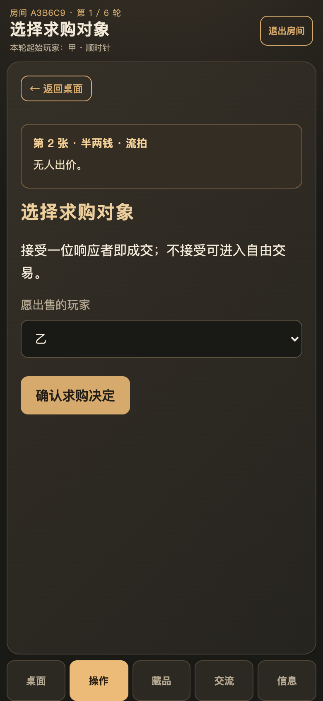

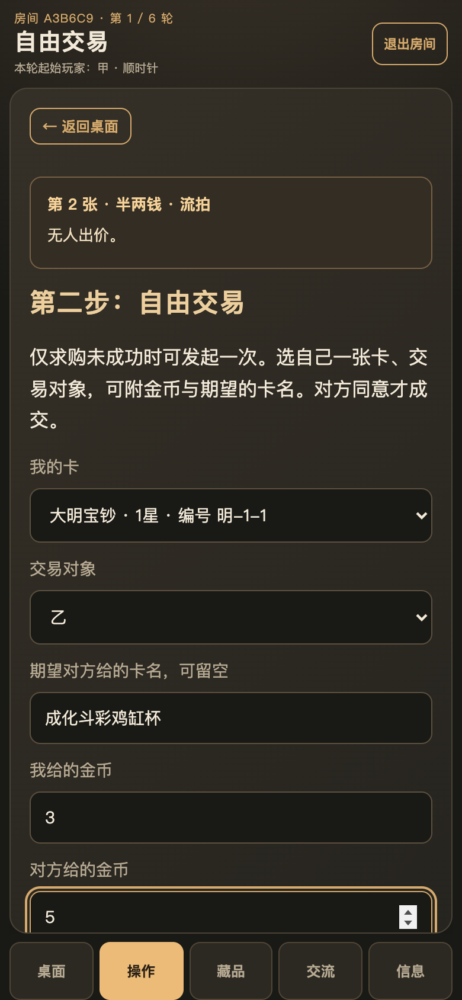

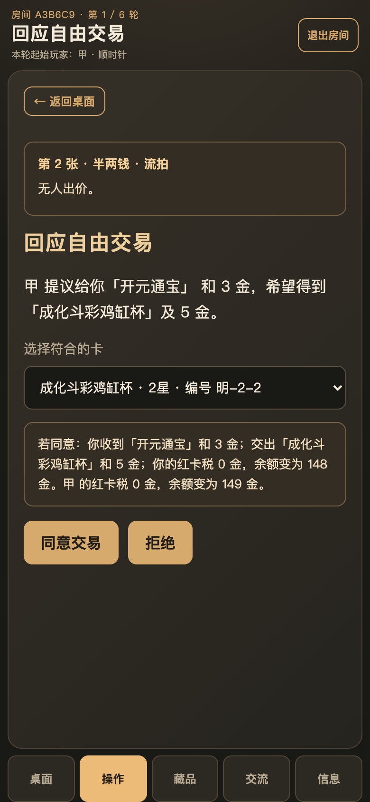

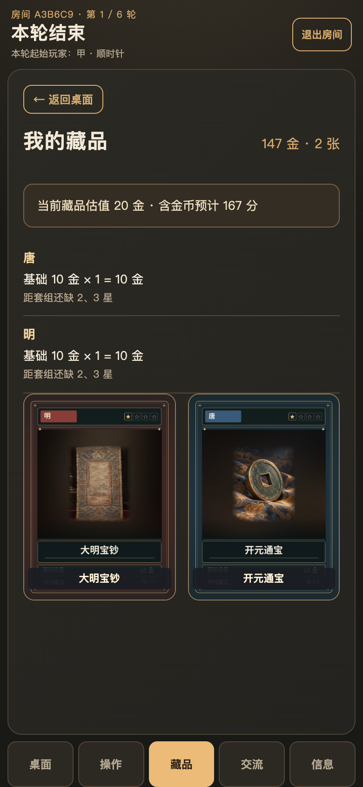

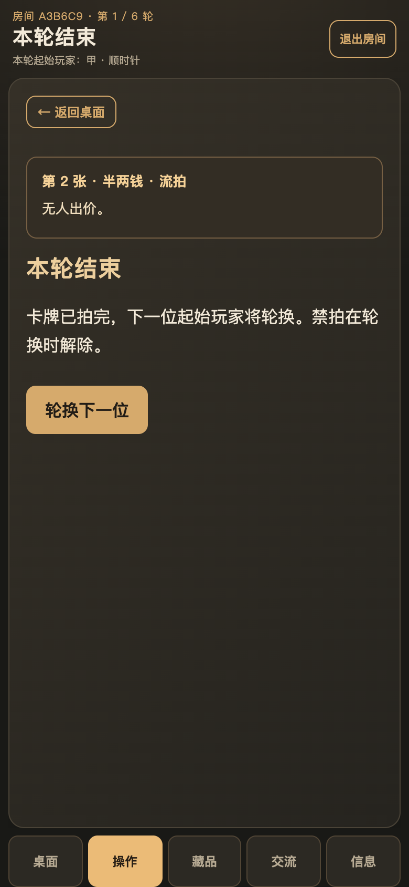

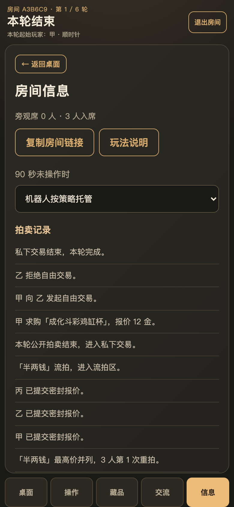

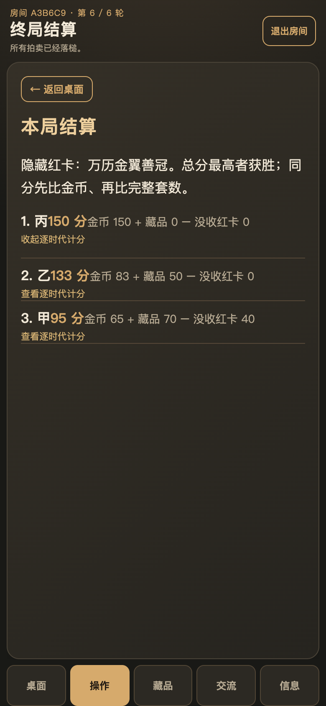

## 3. 房间、身份、开局场景清单

| ID | 触发与操作 | 当前实现 / 产品应确认的结果 | 确认 |
|---|---|---|---|
| R01 | 甲建房 | 获得 6 位房间码与首个座位；可复制链接邀请乙丙 | □符合 □待调整 |
| R02 | 乙丙打开链接 | 先旁观；点击空位入席。旁观者可以看公开桌面与交流 | □符合 □待调整 |
| R03 | 同名加入或房间满 | 拒绝重复昵称；房间成员含旁观者最多 24 人，桌边最多 6 席 | □符合 □待调整 |
| R04 | 甲作为房主安排机器人 | 只能安排到空位，可在开局前移除；真人座位不能被机器人替换 | □符合 □待调整 |
| R05 | 少于 3 席点击开局 | 开局按钮不可用；规则层也拒绝少于 3 人 | □符合 □待调整 |
| R06 | 3 人开局后有人晚到 | 晚到者只能旁观；已有座位锁定，本局不能换座/离席 | □符合 □待调整 |
| R07 | 首位掷骰并列 | 仅并列最高者重掷，直到出现唯一最高者 | □符合 □待调整 |
| R08 | 选轮换方向 | 仅第一位起始玩家选顺时针或逆时针；后续 5 轮沿用 | □符合 □待调整 |
| R09 | 非房主尝试开局或改机器人 | 服务端拒绝；客户端不呈现对应房主控件 | □符合 □待调整 |

**UI 判定。** 桌面展示 6 个固定座位、入席人数、头像、昵称、金币。手机页面底部有“桌面 / 操作 / 藏品 / 交流 / 信息”入口；当前阶段标题和轮次固定在页头。开局前房主点击空位可安排机器人。云端账号或游客可参与，游客关闭浏览器后可能失去原席位。

## 4. 轮次、盲标、拍前出售清单

| ID | 触发与操作 | 当前实现 / 产品应确认的结果 | 确认 |
|---|---|---|---|
| T01 | 第 1 至第 6 轮开始 | 当前持有红卡先产金，拍卖行再对四种星级分别掷 D6 更新倍率，随后抽 2 张背面卡 | □符合 □待调整 |
| T02 | 起始玩家盲标第 1 或第 2 张 | 背面选择，不看内容；选中卡移到首位先拍并常亮金色边框，只有起始玩家本人拍得才八折 | □符合 □待调整 |
| T03 | 选择第一张拍法 | 第一张可选明拍或暗拍；第二张自动相反 | □符合 □待调整 |
| T04 | 未选心仪卡直接确认 | 前端确认按钮禁用；服务端拒绝越界位置 | □符合 □待调整 |
| T05 | 第 1/2 张翻牌前 | 每人都看到自己的出售入口和四种倍率；银行只收购手牌，无法从银行买牌 | □符合 □待调整 |
| T06 | 一人在同一出售窗口多次出售 | 允许卖任意张，逐张按当时倍率结算；每卖一张使该星级倍率下降 10 个百分点 | □符合 □待调整 |
| T07 | 卖普通卡 | 出售前弹窗确认；收益 = floor(基础估值 × max(0,100%+该星级累计变化))；确认后卡从手牌转入银行 | □符合 □待调整 |
| T08 | 卖红卡 | 在 T07 成交价基础上扣 ceil(20% 税)，金钱增加净额；红卡移出手牌后不再产金 | □符合 □待调整 |
| T09 | 点击“本张卡已结束出售” | 点击“设为已准备”后暂不能卖，点击“改为未准备”可继续卖；全员准备前可切换 | □符合 □待调整 |
| T10 | 有任一玩家未确认 | 起始玩家不能翻牌；操作页显示已准备人数及本人状态 | □符合 □待调整 |
| T11 | 全员确认 | 只有起始玩家可点“翻牌，开始拍卖”；所有人看到同一张牌与拍法 | □符合 □待调整 |
| T12 | 抽牌堆为空 | 通用兜底将流拍区洗回后继续抽；如果最终不足牌则跳过对应正式拍卖。正常三人局 12 次抽牌无需该兜底 | □符合 □待调整 |

**银行倍率示例。** 2 星基础估值 20 金，当前倍率 130%，卖出得 floor(20×1.3)=26 金；卖后 2 星倍率降为 120%。若同星持续出售，倍率可以低于 100%，最低成交价为 0。每轮开局 D6 为 1-2 点加 10、3-4 点加 20、5-6 点加 30 个百分点；星级累计上涨最多到 +30 个百分点，出售造成的下降没有下限。

**红卡产金示例。** 有同时代红卡及 2 张同系卡，共 3 张，未凑齐 1/2/3 星：下一轮开始得 3×2=6 金。若持有红卡和完整 1/2/3 星，共 4 张：得 4×4=16 金。红卡在轮次开始时归谁，收益就归谁；本轮交易刚得到的红卡从下一轮开始生效。

## 5. 明拍、暗拍、付款与流拍清单

| ID | 触发与操作 | 当前实现 / 产品应确认的结果 | 确认 |
|---|---|---|---|
| A01 | 明拍开始 | 所有未禁拍玩家可参与，包括起始玩家；起价 = max(5,基础估值÷2) | □符合 □待调整 |
| A02 | 明拍轮到某人 | 报价必须为整数且不超过现有金币；首次不低于起价，后续至少比当前最高价高 2 金；+2/+5/+10 可填入对应金额，仍需点击出价 | □符合 □待调整 |
| A03 | 明拍点击退出 | 本张拍卖中不再出价；若无人出价则流拍，若只剩最高出价者则落槌 | □符合 □待调整 |
| A04 | 暗拍开始 | 每名有资格者秘密提交一次 0 至现有金币的整数报价；0 表示放弃，未提交前不公开金额 | □符合 □待调整 |
| A05 | 暗拍最高价并列 | 仅并列最高者重拍；最多 3 次重拍，仍并列则流拍 | □符合 □待调整 |
| A06 | 重拍有人填 0 | 0 为放弃；若重新报价后无人给正价，则本张流拍 | □符合 □待调整 |
| A07 | 没有有资格竞拍者 | 直接进入流拍结算，不出现悬空行动 | □符合 □待调整 |
| A08 | 落槌并计算骰修正 | 本张只掷 1 次 D6：1/2/3 点为 +星级×点数；4/5/6 点为 -星级×(点数-3) | □符合 □待调整 |
| A09 | 修正后付款为负 | 取 max(0,报价+修正)；允许 0 金成交 | □符合 □待调整 |
| A10 | 起始玩家拍中标记卡 | 先做骰修正和最低 0，再 ×0.8 向上取整。其他人拍中该卡无折扣 | □符合 □待调整 |
| A11 | 玩家通过拍卖得到第 2 张红卡 | 对折扣后金额再加 ceil(50% 奢侈税)；第 3 张及以后加 ceil(100%) | □符合 □待调整 |
| A12 | 第一高价者实付超余额 | 不付款也不拿卡，禁拍接下来 2 场正式拍卖；下一高价者用同一骰面依序尝试接手 | □符合 □待调整 |
| A13 | 第二或第三顺位者超余额 | 跳过该顺位，不追加禁拍；最多尝试前三位有效报价者 | □符合 □待调整 |
| A14 | 三人都无法付款 | 流拍，卡进流拍区；当前轮换开始时会清除未结束的禁拍 | □符合 □待调整 |
| A15 | 有人成交 | 卡入得主私牌；红卡公开展示；实际付款从得主金币扣除，落槌结算单显示报价、骰点、修正、折扣、税和实付 | □符合 □待调整 |
| A16 | 出价输入超限或旁观者试投 | 服务端拒绝小数、负数、余额以上或不属于当前玩家的动作 | □符合 □待调整 |

**付款示例 1。** 2 星卡报价 19 金、骰 2 点，修正 +4，实付 23 金。若这张恰是起始玩家的心仪卡，实付 ceil(23×0.8)=19 金。

**付款示例 2。** 4 星红卡报价 40 金、骰 1 点，修正 +4；已有 1 张红卡，奢侈税 ceil(44×50%)=22，合计 66 金。若同时是心仪卡，先按八折得到 ceil(44×0.8)=36，再加 18 金税，合计 54 金。

**说明。** 界面在提交出价前展示六种骰面对应的可能实付范围。最高实付超过当前余额时提示失约风险，但玩家仍可出价。落槌结算时已不能临时卖牌凑款。明拍提供 +2/+5/+10 快捷按钮，按起拍价或当前最高价为基数填写金额，仍需点击“出价”提交。

## 6. 私下求购、自由交易清单

| ID | 触发与操作 | 当前实现 / 产品应确认的结果 | 确认 |
|---|---|---|---|
| D01 | 两张正式拍卖结束 | 本轮才进入私下交易，先由起始玩家选择求购或跳过 | □符合 □待调整 |
| D02 | 发起求购 | 必须填准确卡名、0 至当前金币的整数报价；需求公开给另两位玩家 | □符合 □待调整 |
| D03 | 持卡人回应 | 可选自己一张同名实体卡或“不出售”；各自提交后不能重复回应 | □符合 □待调整 |
| D04 | 无人愿卖 | 起始玩家进入自由交易步骤 | □符合 □待调整 |
| D05 | 多人愿卖 | 起始玩家只选择其中一位成交；也可不接受，转入自由交易 | □符合 □待调整 |
| D06 | 求购成交 | 买家付出报价并得到卡；卖家收到报价，卖出红卡时再交 ceil(20% 报价) 税；本轮交易结束 | □符合 □待调整 |
| D07 | 起始玩家跳过求购 | 直接进入自由交易；可继续选择结束本轮交易 | □符合 □待调整 |
| D08 | 自由交易发起 | 必须拿出自己 1 张卡，指定对象；可填双方金币和想要对方给的准确卡名 | □符合 □待调整 |
| D09 | 对方手里没有指定卡名 | 无法构成合规同意；对方可拒绝；服务端拒绝不匹配的卡牌 | □符合 □待调整 |
| D10 | 对方同意 | 双方按提案互换卡与金币；若卖出的卡是红卡且收到了金币，卖方按收到的金额交 20% 税 | □符合 □待调整 |
| D11 | 对方拒绝 | 本轮私下交易立即结束；起始玩家不能再发第二次自由交易 | □符合 □待调整 |
| D12 | 双方金币、卡牌在回应时发生变化 | 服务端再次校验持牌、余额与红卡税；不足则拒绝成交 | □符合 □待调整 |

**求购例。** 甲出 13 金求购乙的红卡；乙成交价 13，红卡税 ceil(13×20%)=3，乙净得 10 金，甲得红卡并扣 13 金。求购响应前、自由交易发起和回应页均提供卡牌与金币预览；自由交易发起时，接收方最终选出的实体卡尚未确定，因此对方涉及红卡税的余额为预估，回应页才展示双方确定余额。

## 7. 红卡、套组与终局计分清单

| ID | 触发与操作 | 当前实现 / 产品应确认的结果 | 确认 |
|---|---|---|---|
| S01 | 无红卡且持有同一时代 1/2/3 星 | 同时代所有实体卡估值 ×1.5；重复卡也享倍率，但不替代缺失星级 | □符合 □待调整 |
| S02 | 1/2/3 星齐且持有红卡 | 同时代所有实体卡估值 ×2，并计为一套完整四星套组 | □符合 □待调整 |
| S03 | 有红卡却缺 1/2/3 任一星 | 倍率为 ×1，额外没收红卡基础估值 40；非红卡仍按基础估值计分 | □符合 □待调整 |
| S04 | 本局某时代红卡被隐藏 | 该时代无法完成 1234；仍可凭 123 触发 ×1.5 | □符合 □待调整 |
| S05 | 终局分为负 | 允许负分；胜负比较照常按总分排序 | □符合 □待调整 |
| S06 | 两人总分相同 | 先比剩余金币；仍相同再比完整四星套数；再相同按入席顺序 | □符合 □待调整 |
| S07 | 终局页面 | 揭示隐藏红卡，显示排名、金币、藏品估值与没收额；点击名次可展开逐时代明细 | □符合 □待调整 |
| S08 | 局中查看自己的藏品 | 按当前持牌即时计算估值与预计总分、各时代缺少的星级；只是“若此刻结束”的参考 | □符合 □待调整 |

**套组例。** 同时代各有 1 星 10、2 星 20、3 星 30：基础总和 60，完成 123 后计 90 分。再持有红卡 40：基础总和 100，按 ×2 得 200 分。只持有 2 星和红卡：基础估值 60，红卡没收 40，该时代净得 20 分。

**积分公式。** 对每个时代分别计算：`时代净值 = 基础估值总和 × 倍率 - 不完整红卡没收额`；总分 = 剩余金币 + 各时代净值。红卡产金是局中金币变化，终局不再次单独加一次。

## 8. UI、旁观、在线、异常场景清单

| ID | 触发与操作 | 当前实现 / 产品应确认的结果 | 确认 |
|---|---|---|---|
| U01 | 手机查看房间 | 底部切换桌面、操作、藏品、交流、信息；当前阶段、轮次、起始玩家在页头 | □符合 □待调整 |
| U02 | 桌面浏览器查看房间 | 桌面围桌区、操作区、藏品区、交流与记录并列；按视口尺寸响应排列 | □符合 □待调整 |
| U03 | 查看拍卖行倍率 | 桌面页头展示 1-4 星倍率；操作页拍前出售窗口上方也展示全部四种倍率，手机可见 | □符合 □待调整 |
| U04 | 旁观者加入正在进行的房间 | 可看公开座位、拍卖和交流；看不到他人普通私牌、暗拍报价、候选卡牌面 | □符合 □待调整 |
| U05 | 发送文字 / 语音 | 文字最多 300 字；语音按住录制，最多 15 秒；旁观者也可交流 | □符合 □待调整 |
| U06 | 真人行动 90 秒未完成 | 当前行动玩家显示倒计时；到时按“按策略托管”或“竞拍放弃，其余托管”设置处理；可在操作页点击接管 | □符合 □待调整 |
| U07 | 云端账号超过 60 秒无在线心跳 | 被认定离线，机器人托管；账号返回后恢复席位；游客凭证可能失效 | □符合 □待调整 |
| U08 | 页面刷新、切出微信再返回 | 页面暂时隐藏不主动离房；返回浏览器缓存页立即刷新；云端仍有客户端 ID 校验和在线超时 | □符合 □待调整 |
| U09 | 断网或请求冲突 | 页面显示错误提示；云端同房间并发更新用 revision 防覆盖，冲突返回重试 | □符合 □待调整 |
| U10 | 非本人尝试操作他人席位 / 机器人 | 服务端根据账号或游客凭证绑定席位，拒绝越权和机器人冒用 | □符合 □待调整 |
| U11 | 游客房主在等待页离开 | 在线成员可接任房主继续配置机器人并开局 | □符合 □待调整 |
| U12 | 线上注册、验证与登录 | 账号可通过邮箱注册、验证并登录；游客无需邮箱也可建房参与 | □符合 □待调整 |

**需特别确认的展示边界。** 起始玩家选择的心仪卡移至首位，背面牌和翻面拍卖卡均有常亮金色边框。红卡一旦获得向全场公开，普通藏品只显示张数。暗拍提交状态人数公开，具体金额仅在揭晓结算后通过记录可见。局中“预计总分”仅本人可见，终局后所有人的手牌与计分可见。

## 9. 三人局界面状态转移总览

| 当前阶段 | 主操作人 | 成功后阶段 | 拒绝或例外 |
|---|---|---|---|
| 等待入席 | 房主 / 新玩家 | 盲标与定序 | 少于 3 席不能开局；开局后不能再入席 |
| 盲标与定序 | 起始玩家 | 拍前出售 | 心仪卡位置无效、拍法无效则拒绝 |
| 拍前出售 | 全员，再由起始玩家翻牌 | 明拍或暗拍 | 未全员准备不能翻牌；已准备可撤回，撤回后可继续卖 |
| 明拍 | 当前轮到的竞买人 | 下一张出售或私下求购 | 所有人退出则流拍；有效最高价落槌后再检查实付 |
| 暗拍 | 每名有资格竞买人 | 下一张出售或私下求购 | 最高同价进入重拍；第三次重拍仍同价流拍 |
| 私下求购 | 起始玩家 | 回应求购 / 自由交易 | 可跳过求购 |
| 回应求购 | 其他两人 | 选择求购对象 | 不响应、无同名卡可选择不出售 |
| 选择求购对象 | 起始玩家 | 本轮结束 / 自由交易 | 可拒绝所有响应者 |
| 自由交易 | 起始玩家 | 回应自由交易 / 本轮结束 | 必须拿出自己的卡；可主动结束 |
| 回应自由交易 | 被指定对象 | 本轮结束 | 对方拒绝、卡牌不符或金币不足则无交易 |
| 本轮结束 | 起始玩家 | 下一轮盲标 / 终局 | 第 6 轮后结束，不进入第 7 轮 |

## 10. 产品确认记录模板

| 确认范围 / 场景 ID | 结论（符合 / 修改 / 暂缓） | 期望改成什么 | 优先级 | 负责人 / 日期 |
|---|---|---|---|---|
| 房间与身份 R01-R09 |  |  |  |  |
| 轮次与出售 T01-T12 |  |  |  |  |
| 拍卖与付款 A01-A16 |  |  |  |  |
| 私下交易 D01-D12 |  |  |  |  |
| 计分 S01-S08 |  |  |  |  |
| 在线与界面 U01-U12 |  |  |  |  |

## 11. 附件 2.2.2 六项实现状态

以下逐项核对《拍卖玩法优化建议.pdf》的 2.2.2 六项。截图反映本地当前实现；本次改动尚未部署线上。

| 附件项 | 当前实现状态 | 产品待确认 |
|---|---|---|
| 心仪卡优先拍卖，并常亮边框 | **已实现（本地）。** 选中的卡移至首位，背面与翻面卡保持金色边框；起始玩家拍得仍享八折 | 确认移动牌序符合预期 |
| 切换到微信后异常跳终局 | **代码已修复，待真机回归。** 移除页面暂时隐藏时主动发送离房请求；返回缓存页时立即刷新。仍受 60 秒无心跳离线与 90 秒操作超时影响 | 微信内切出/返回各测短暂和超过 90 秒两种场景 |
| 已准备 / 未准备切换、卖卡确认弹窗 | **已实现（本地）。** 准备可撤回；出售前弹窗列出成交价、红卡税、实收 | 确认弹窗金额与文案 |
| 四星级溢价信息置于操作页右上角 | **已实现（本地）。** 拍前操作区顶部靠右展示四种倍率，窄屏自动换行 | 确认手机排版 |
| 明拍 +2 / +5 / +10 快捷按钮 | **已实现（本地）。** 按当前最高价加对应金币；无人出价时按起拍价加；填入后仍需点击出价 | 确认快捷按钮基数 |
| 藏品页实时总金额 | **已实现（本地）。** 显示局中藏品估值、含金币预计总分与逐时代缺口 | 确认分数口径 |

## 12. 文档维护与来源

**单一维护入口。** 本 Markdown 是可编辑正文；PDF 是发布给产品确认的排版版。真实界面截图由 `scripts/capture-product-spec.mjs` 根据 `web/game.js` 的确定性三人演示局、当前 `web/app.js` 与 `web/style.css` 重新生成，图片位于 `docs/product-spec-assets/`。最终 PDF 的生成脚本与输出路径记录在 `scripts/build-product-spec.py`。

**每次规则或 UI 改动时同步更新。** 修改 `web/game.js`、`web/app.js`、`web/style.css`、账号房间接口、卡牌目录、机器人策略或说明书时，先更新本稿相关场景 ID、三人示例、状态与产品确认栏，再重跑截图生成和 PDF 构建，检查页码、文字和图片。若只是改视觉，也要更新受影响截图。旧版确认意见应保留在变更记录里，新 PDF 使用清楚的快照日期。

**本稿的权威来源。** 规则裁决：`web/game.js`；界面文案与呈现：`web/app.js`、`web/style.css`；云端身份与离线：`supabase/functions/game/handler.js`；牌库：`web/catalog.js`；回归验证：`tests/game.test.js`、`tests/cloud.test.js`；背景规则与历史修订：`docs/01-规则漏洞与修订.md`、`docs/03-小白说明书.md`。附件 2.2.2 建议仅用于第 11 节的计划项对照，不替代代码现状。

**变更记录。**

| 日期 | 范围 | 对应截图 / 场景 | 结果 |
|---|---|---|---|
| 2026-09-25 | 首版，覆盖三人局完整流程、规则分支、UI 与云端边界 | 01-16，R/T/A/D/S/U 全部场景 | 待产品逐项确认 |
| 2026-09-25 | 2.2.2 状态核对并补齐心仪卡首拍、准备切换、出售弹窗、倍率与快捷出价；调整微信切出处理 | 01-16、05b 及 T/A/U 相关场景 | 微信切出待真机回归 |
